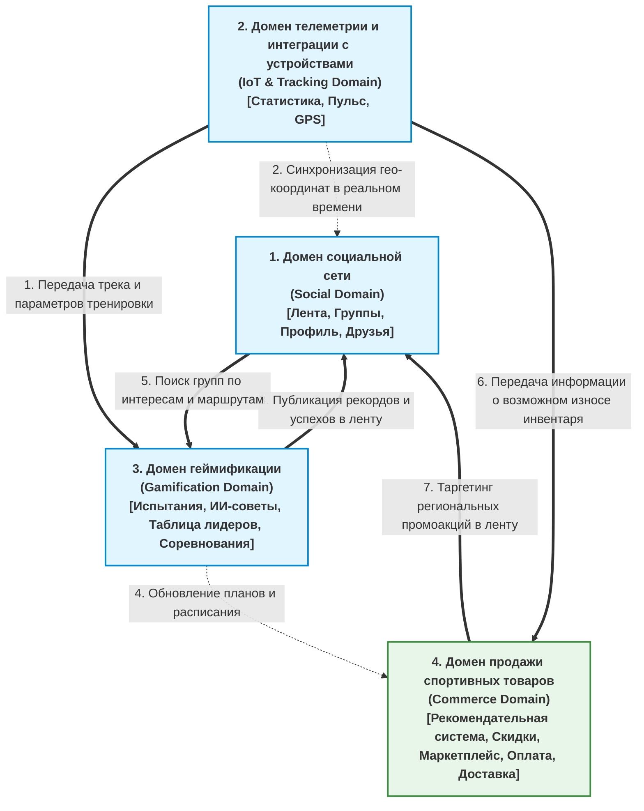

[← Назад в Главное меню](../README.md)

# Функциональные требования

### Выделим основные домены будущего приложения и функциональные требования для них:

### 1. Домен социальной сети. Функциональные требования:
    1.1. Управление социальными группами. Возможность создания, ведения, модерации, вступления в спортивные социальные группы.  
    1.2. Поиск единомышленников. Рекомендательная система поиска напарников на основе схожих интересов, активного тсатуса тренировки и близкого расположения тренирующихся.  
    1.3. Лента новостей и событийны контур. Формирование персональной ленты личных постов популярных или находящихся рядом спортсменов, постов социальных групп, персонализированных рекламных объявлений, скидок, акций и приближающихся в данном регионе событий и соревнований.  
    1.4. Система уведомлений и напоминаний. Автоматическое напоминание о тренировках, уведомление о личных успехах или успехах друзей, рекламные уведомления, увежомления о соревнованиях и событиях.  

### 2. Домен телеметрии и интеграции с устройствами. Функциональные требования:
    2.1. Подключение сторонних фитнес утсройств. Соединение должно стабильно поддерживаться на постоянном уровне и снимать максиум физических метрик тренирующегося.  
    2.2. Интеграция с нативными фитнес-функциями телефонов. Приложение должно в фоновоом режиме считывать и агрегировать данные из встроенных сситема смартфонов.  
    2.3. Поддержка автономного режима работы (Offline-First). Приложение должно фиксировать телеметрию даже при условиях отсуствия соединения. Собранные данные синхронизируются с остальными доменами при появлении интернета.  
    2.4. Статистические графики. Приложение должно показывать различные графики активности за заданный период времени, чтобы человек мог лично оценить свои упехи.  

### 3. Домен геймификации. Функциональные требования:
    3.1. Формирование системы испытаний. Система генерирует список испытаний в зависимости от спортивного увлечения, за выполнение которых начисляет локальную валюту. Валюту можно тратить на особые элементы украшения профиля или его продвижение.  
    3.2. Турнирные таблицы (личные и социальных групп). Проводим события, как для единичных участников, так и для целых социальных групп. Даём глобальные испытания, проводим офлайн соревнования, награждаем товарами собственного бренда, мерчом, большим количеством валюты приложения.  
    3.3. Система удержания и поощрения. Добавляем награды за ежедневный вход, поддержание плана тренировок, добавляем систему трофеев, которые можно коллекционировать. Интегрируем эту систему с системами увежомлений и ленты.  
    3.4. Индивидуальная поддержка пользователей. Формируем ИИ-агента, который будем помогать пользователем составлять планы тренировок, мотивировать их заниматься, составлять план питания и расчёта КБЖУ.  

### 4. Домен продажи спортивных товаров. Функциональные требования:
    4.1. Цифровой профиль спортивного инвентаря. Система долна мотивировать пользователей вносить данные о своём инвентаре в профиль (домен геймификации) и расчитывать процент износа инвентаря со временем. В случае серьёзного износа мы рекомендуем обновить инвентарь товарами из нашего маркетплейса.  
    4.2. Бесшовная API-интеграция с Маркетплейсом компании. Свободный доступ из любого места приложения, каждый домент так или иначе продвигать маркетплейс и рекомендовать его товары пользователям.  
    4.3. Динамический таргетинг региональных промоакций. Система должна подстраиваться под глобальные события, локальные праздники, дни рождения пользователей, их активность в маркетплейсе и предоставлять персональные акции и скидки.  
