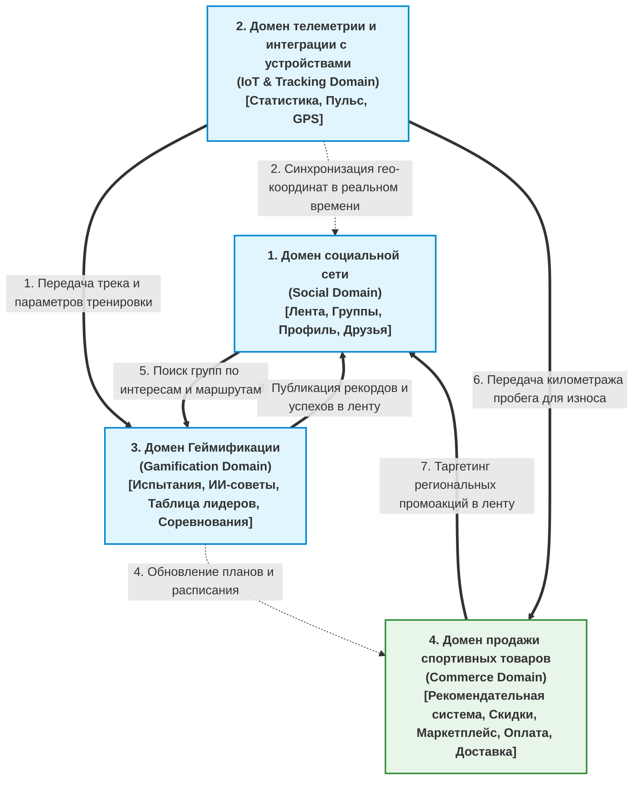

[← Назад в Главное меню](../README.md)

#Функциональные требования

###Выделим основные домены будущего приложения и функциональные требования для них:

```mermaid
graph TD
    classDef domain fill:#e1f5fe,stroke:#0288d1,stroke-width:2px,font-weight:bold;
    classDef commerce fill:#e8f5e9,stroke:#388e3c,stroke-width:2px,font-weight:bold;

    %% Определение доменов
    D_SOCIAL["1. Домен социальной сети<br/>(Social Domain)<br/>[Лента, Группы, Профиль, Друзья]"]:::domain
    D_IOT["2. Домен телеметрии и интеграции с устройствами<br/>(IoT & Tracking Domain)<br/>[Статистика, Пульс, GPS]"]:::domain
    D_GAME["3. Домен Геймификации<br/>(Gamification Domain)<br/>[Испытания, ИИ-советы, Таблица лидеров, Соревнования]"]:::domain
    D_COMMERCE["4. Домен продажи спортивных товаров<br/>(Commerce Domain)<br/>[Рекомендательная система, Скидки, Маркетплейс, Оплата, Доставка]"]:::commerce

    %% Взаимодействие и потоки данных
    D_IOT ==>|1. Передача трека и параметров тренировки| D_GAME
    D_IOT -.->|2. Синхронизация гео-координат в реальном времени| D_SOCIAL
    
    D_GAME ==>|3. Публикация рекордов и успехов в ленту| D_SOCIAL
    D_GAME -.->|4. Обновление планов и расписания| D_COMMERCE

    D_SOCIAL ==>|5. Поиск групп по интересам и маршрутам| D_GAME
    
    D_IOT ==>|6. Передача километража пробега для износа| D_COMMERCE
    D_COMMERCE ==>|7. Таргетинг региональных промоакций в ленту| D_SOCIAL

    style D_COMMERCE fill:#e8f5e9,stroke:#388e3c
```
