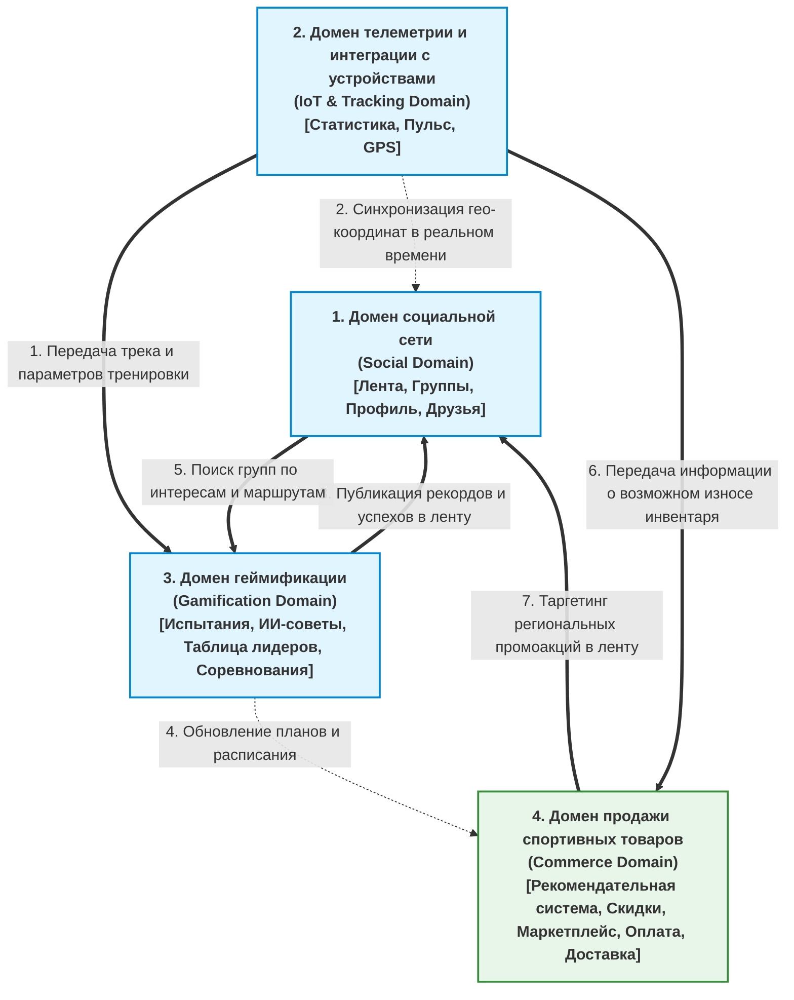

[← Назад в Главное меню](../README.md)

# Контур 2. Функциональные требования.

### Выделим основные домены будущего приложения и функциональные требования для них:

### 1. Домен социальной сети. Функциональные требования:

*   **1.1. Управление социальными группами:**  
    Возможность создания, ведения, модерации и вступления в спортивные  
    социальные группы по интересам участников.
*   **1.2. Поиск единомышленников:**  
    Рекомендательная система поиска напарников на основе схожих интересов,  
    активного статуса тренировки и близкого гео-расположения тренирующихся  
    в реальном времени.
*   **1.3. Лента новостей и событийный контур:**  
    Формирование персональной ленты личных постов популярных или находящихся  
    рядом спортсменов, постов социальных групп, а также отображение  
    персонализированных рекламных объявлений, скидок, акций (поставляемых  
    из коммерческого контура) и приближающихся в данном регионе соревнований.
*   **1.4. Система уведомлений и напоминаний:**  
    Автоматическое напоминание о тренировках, уведомление о личных успехах  
    или успехах друзей, рекламные уведомления, оповещения о соревнованиях  
    и спортивных событиях.

---

### 2. Домен телеметрии и интеграции с устройствами. Функциональные требования:

*   **2.1. Подключение сторонних фитнес-устройств:**  
    Соединение должно стабильно поддерживаться на постоянном уровне и снимать  
    максимум физических метрик тренирующегося (пульс, кислород) в реальном времени.
*   **2.2. Интеграция с нативными фитнес-функциями телефонов:**  
    Приложение должно в фоновом режиме считывать и агрегировать данные  
    активности из встроенных систем смартфонов (Apple HealthKit / Google Fit).
*   **2.3. Поддержка автономного режима работы (Offline-First):**  
    Приложение должно фиксировать телеметрию даже при условиях отсутствия  
    сетевого соединения. Собранные данные автоматически синхронизируются  
    с остальными доменами при появлении сети интернет.
*   **2.4. Статистические графики:**  
    Приложение должно генерировать и показывать различные визуальные графики  
    активности за заданный период времени, чтобы человек мог лично оценить  
    свои успехи и динамику результатов.

### 3. Домен геймификации. Функциональные требования:

*   **3.1. Формирование системы испытаний:**  
    Система генерирует список испытаний в зависимости от спортивного увлечения,  
    за выполнение которых начисляет локальную валюту приложения. Локальную валюту  
    можно расходовать на особые элементы украшения профиля или его продвижение.
*   **3.2. Турнирные таблицы (Личные и Социальных групп):**  
    Проведение соревновательных событий как для единичных участников, так и для  
    целых социальных групп. Предоставление глобальных испытаний, проведение  
    масштабных офлайн-соревнований, награждение товарами собственного бренда,  
    фирменным мерчем и повышенным объемом внутренней валюты.
*   **3.3. Система удержания и поощрения:**  
    Внедрение наград за ежедневный вход в приложение, поддержание регулярного  
    плана тренировок, а также система трофеев, доступных для коллекционирования.  
    Интеграция данной системы с механизмами уведомлений и социальной ленты.
*   **3.4. Индивидуальная поддержка пользователей:**  
    Формирование ИИ-агента (цифрового наставника), который помогает пользователям  
    составлять индивидуальные планы тренировок, мотивирует заниматься, формирует  
    планы здорового питания и производит автоматический расчет КБЖУ.

---

### 4. Домен продажи спортивных товаров. Функциональные требования:

*   **4.1. Цифровой профиль спортивного инвентаря:**  
    Система должна мотивировать пользователей вносить данные о своем текущем  
    инвентаре в профиль (через интеграцию с доменом геймификации) и автоматически  
    рассчитывать процент износа инвентаря со временем на основе тренировок.  
    В случае критического износа система рекомендует обновить инвентарь.
*   **4.2. Бесшовная API-интеграция с Маркетплейсом компании:**  
    Предоставление сквозных интерфейсов доступа к маркетплейсу из любого контекста  
    приложения. Домен электронной коммерции поставляет структурированные данные  
    каталога для генерации контекстных рекомендаций товаров в сопутствующих доменах.
*   **4.3. Динамический таргетинг региональных промоакций:**  
    Система должна гибко подстраиваться под мировые и локальные спортивные события,  
    региональные праздники, дни рождения пользователей, а также их историю активности  
    на маркетплейсе бренда для предоставления точечных персональных акций и скидок.
