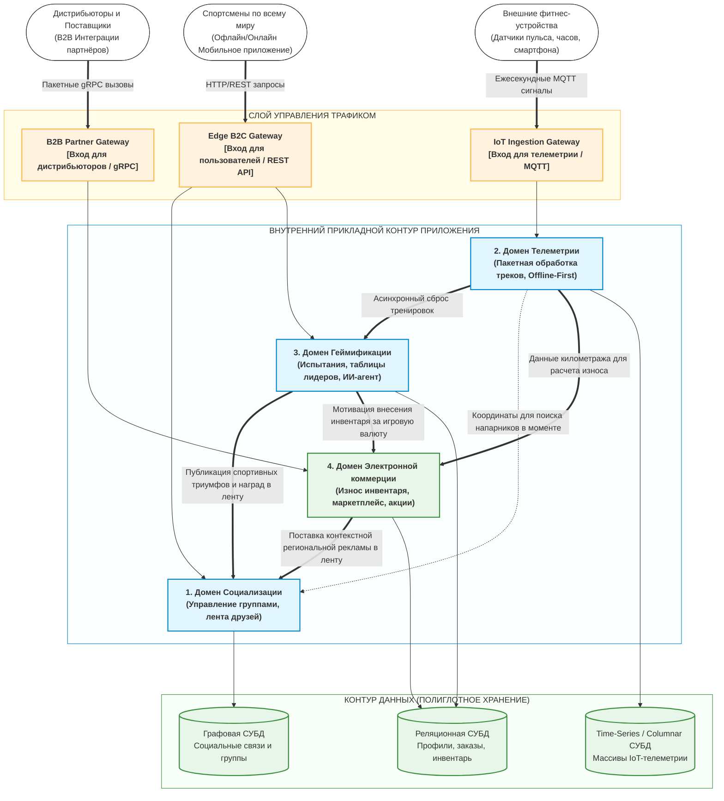

[← Назад в Главное меню](../README.md)

# Артефакт 4. Концептуальная архитектура.

Учитывая транснациональный масштаб, гетерогенность технологий и огромные объемы 
данных спортивной социальной сети, монолитный подход к проектированию неприменим. 
Данная концептуальная архитектура базируется на разделении системы по изолированным 
бизнес-доменам (Bounded Contexts). Это позволяет различным командам разработчиков 
независимо развивать свои модули на разных языках программирования и разворачивать 
их в рамках гибридной Multi-Cloud инфраструктуры.

---

### Схема концептуальной архитектуры и потоков данных

Ниже представлена глобальная схема движения трафика и взаимодействия ключевых 
доменов системы — от внешних источников и IoT-устройств до изолированного слоя данных:

---

### Архитектурное описание структуры и потоков данных:

1.  **Слой управления трафиком (API Gateways):**  
    Входящие потоки строго разделены на сетевом периметре для исключения влияния 
    пиковых нагрузок друг на друга. Розничные пользователи идут через легкий 
    HTTP-шлюз `Edge B2C`. Дистрибьюторы передают каталоги через производительный 
    gRPC-шлюз `B2B Partner`. Ежесекундные сигналы медицинских датчиков и часов 
    аккумулируются специализированным шлюзом `IoT Ingestion` по протоколу MQTT, 
    что защищает внутренние серверы от перегрузки сетевых соединений.
2.  **Децентрализация прикладного контура:**  
    Каждый из четырех доменов представляет собой самостоятельный контекст. Сервисы 
    домена Телеметрии сфокусированы исключительно на быстром приеме координат и пульса. 
    Они не знают о существовании маркетплейса, а лишь передают асинхронные сообщения 
    с километражем в домен Электронной коммерции, который изолированно рассчитывает 
    амортизацию кроссовок.
3.  **Полиглотное хранение данных (Polyglot Persistence):**  
    Вместо единой СУБД под разные типы данных выбраны специализированные решения:
    *   *Графовая СУБД* идеально приспособлена для мгновенного обхода цепочек друзей, 
        спортивных групп и поиска напарников поблизости.
    *   *Time-Series / Колоночная СУБД* оптимизирована под тяжелую ежесекундную 
        запись миллиардов точек GPS-треков и пульса от миллионов устройств по всему миру.
    *   *Реляционная СУБД* гарантирует строгую согласованность данных, транзакционность 
        и надежность при оформлении заказов, списании денег и управлении инвентарем.
