```mermaid
gantt
    title Поэтапный план реализации ИТ-инфраструктуры экосистемы
    dateFormat  X
    axisFormat Шаг %d

    section Этап 1: Коммерческое ядро (MVP)
    Шлюзы Edge B2C и B2B Partner           :active, p1, 0, 15
    Маркетплейс, профиль инвентаря и износ :active, p2, 0, 20
    Реляционная СУБД и базовый трекинг     :active, p3, 5, 25

    section Этап 2: Социализация и Трафик
    Графовая СУБД и связи пользователей    : p4, 20, 35
    Лента новостей и поиск напарников      : p5, 25, 40
    Шлюз IoT Ingestion и телеметрия датчиков: p6, 30, 45

    section Этап 3: Геймификация и ИИ
    Игровые валюты, награды и испытания   : p7, 40, 55
    ИИ-агент, планы питания и расчет КБЖУ  : p8, 45, 60
```

[← Назад в Главное меню](../README.md)

# Архитектурный концепт спортивной экосистемы
## Контур 6: План поэтапной разработки и расширения системы

Запускать все функции транснациональной соцсети одновременно — это огромный финансовый и технический риск. Мы делим разработку на три последовательных этапа. Чтобы проект окупался с первых дней, мы выносим интеграцию с продажами и маркетплейсом в состав ядра первого этапа (MVP).

---

### Дорожная карта выката системы (Гант-схема)

Ниже представлена очередность реализации доменов и ключевых компонентов во времени:

---

### Анализ критически важных компонентов и этапы расширения

#### Этап 1. Коммерческое ядро системы (Минимально жизнеспособный продукт)
Цель первого этапа — запустить продажи и дать бизнесу прибыль с первых месяцев работы приложения. На этом шаге мы разворачиваем шлюзы Edge B2C и B2B Partner, подключаем надежную реляционную СУБД и делаем бесшовную интеграцию с уже существующим маркетплейсом компании. Пользователи получают возможность регистрироваться, вносить в профиль свой инвентарь (обувь, снаряды) и вести базовый трекинг активности. 

Критически важный компонент здесь — модуль автоматического расчета износа экипировки. Приложение должно с первых дней четко считать километраж активности, анализировать износ кроссовок и предлагать пользователю купить новые вещи бренда со скидкой. Реклама и продажи начинают работать сразу, окупая затраты на разработку.

#### Этап 2. Социализация и привлечение органического трафика
Когда коммерческий контур и продажи стабилизированы, мы переходим к масштабированию пользовательской базы за счет социальных механик. Мы подключаем Графовую СУБД, которая позволяет людям объединяться в группы по интересам, искать напарников по маршрутам и тренироваться вместе. 

Критически важным компонентом становится движок социальной ленты новостей. Он собирает посты групп и успехи друзей, а коммерческий домен начинает динамически подмешивать туда контекстные региональные промоакции бренда. Также на этом этапе мы разворачиваем шлюз IoT Ingestion для массового подключения продвинутых сторонних фитнес-устройств, фиксации многообразия телеметрии и сбора Big Data для R&D-отдела компании.

#### Этап 3. Геймификация, удержание и интеллектуальный контур
На финальном этапе мы внедряем функции, которые заставляют пользователей оставаться в приложении годами и играть в "долгую". Мы запускаем систему испытаний, глобальных и офлайн-соревнований с турнирными таблицами, вводим локальную игровую валюту и трофеи для коллекционирования. 

Критически важный компонент этого этапа — ИИ-агент (цифровой наставник). Он осуществляет индивидуальную поддержку пользователей, помогает составлять планы тренировок, расписания, координирует графики питания и автоматический расчет КБЖУ. Геймификация мотивирует людей чаще вносить инвентарь в профиль за игровые бонусы, что замыкает цикл и стимулирует новые повторные продажи на маркетплейсе.
