[← Назад в Главное меню](../README.md)

# Архитектурный концепт спортивной экосистемы
## Контур 6: План поэтапной разработки и расширения системы

Запускать все функции транснациональной соцсети одновременно — это огромный финансовый и технический риск. Мы делим разработку на три последовательных этапа. Каждый следующий шаг опирается на уже готовую и протестированную инфраструктуру предыдущего этапа.

---

### Дорожная карта выката системы (Гант-схема)

Ниже представлена очередность реализации доменов и ключевых компонентов во времени:

```mermaid
gantt
    title Поэтапный план реализации ИТ-инфраструктуры экосистемы
    dateFormat  X
    axisFormat Шаг %d

    section Этап 1: Базовое ядро (MVP)
    Шлюзы Edge B2C и IoT Ingestion         :active, p1, 0, 10
    Профили, реляционная СУБД и Time-Series:active, p2, 0, 15
    Локальный трекинг в Offline-First      :active, p3, 5, 20

    section Этап 2: Социализация
    Графовая СУБД и связи пользователей    : p4, 15, 30
    Лента новостей и поиск напарников      : p5, 20, 35
    Шлюз B2B Partner для дистрибьюторов   : p6, 25, 40

    section Этап 3: Интеллектуальный контур
    ИИ-агент, планы питания и тренировок   : p7, 35, 50
    Динамический таргетинг промоакций      : p8, 40, 55
```

---

### Анализ критически важных компонентов и этапы расширения

#### Этап 1. Базовое ядро системы (Минимально жизнеспособный продукт)
На этом шаге мы строим фундамент, без которого приложение вообще не имеет смысла. Сюда входят шлюзы Edge B2C и IoT Ingestion, реляционная база для профилей пользователей и специализированная Time-Series база под спортивные метрики. 

Критически важный компонент здесь — модуль автономного трекинга (Offline-First) на смартфонах. Спортсмены должны иметь возможность стабильно записывать свои координаты и пульс в лесу или горах. Только когда мы добьемся стопроцентной надежной записи треков и их пакетной выгрузки на сервера при появлении сети, этот этап можно считать успешно завершенным.

#### Этап 2. Социализация и запуск сетевого взаимодействия
Когда базовый трекинг работает без сбоев, мы разворачиваем социальный контур. На этом этапе мы подключаем Графовую СУБД, которая будет связывать людей в группы и обеспечивать быстрый поиск напарников поблизости. 

Критически важным компонентом становится движок генерации новостной ленты. Нам нужно реализовать алгоритмы, которые будут мгновенно собирать посты групп, треки друзей и подмешивать туда информацию о местных соревнованиях. Также на этом этапе мы открываем шлюз B2B Partner, чтобы дистрибьюторы могли загружать свои первые рекламные кампании и каталоги инвентаря.

#### Этап 3. Интеллектуальный контур и коммерческая конверсия
Финальный этап переводит приложение в режим максимальной доходности для бизнеса. Мы подключаем ИИ-агента для составления планов питания, расписания тренировок и подсчета КБЖУ. 

Критически важный компонент третьего этапа — модуль динамического таргетинга промоакций. Он собирает данные об износе обуви из коммерческого домена, анализирует активность пользователя и аккуратно выводит персональные скидки бренда в его социальную ленту. На этом этапе приложение полностью связывается с основным маркетплейсом компании, превращая спортивную активность людей в реальные продажи инвентаря.
