[← Назад в Главное меню](../README.md)

# Артефакт 6. План поэтапной разработки и расширения системы.

Запускать все функции транснациональной соцсети одновременно невозможно. Разраблтка займёт много времени, значит нам нужем минимально-жизнеспособный продукт, который должен окупать себя, прежде чем мы его доведём до идеала. Мы делим разработку на три последовательных этапа, они изображены на схеме ниже.

---

### Дорожная карта разработки системы.

```mermaid
gantt
    title Поэтапный план реализации ИТ-инфраструктуры экосистемы
    dateFormat  X
    axisFormat Шаг %d

    section Этап 1: Коммерческое ядро (MVP)
    Шлюзы Edge B2C и B2B Partner           :active, p1, 0, 15
    Маркетплейс, профиль инвентаря и износ :active, p2, 0, 20
    Реляционная СУБД и базовый трекинг     :active, p3, 5, 25

    section Этап 2: Социализация и Трафик
    Графовая СУБД и связи пользователей    : p4, 20, 35
    Лента новостей и поиск напарников      : p5, 25, 40
    Шлюз IoT Ingestion и телеметрия датчиков: p6, 30, 45

    section Этап 3: Геймификация и ИИ
    Игровые валюты, награды и испытания   : p7, 40, 55
    ИИ-агент, планы питания и расчет КБЖУ  : p8, 45, 60
```

---

### Анализ этапов разработки.

#### Этап 1. Коммерческое ядро системы (Минимально жизнеспособный продукт)
Основная цель начального этапа — связать уже существующие системы и увеличить продажи. На этом шаге мы разворачиваем шлюзы Edge B2C и B2B Partner, подключаем реляционные СУБД и делаем интеграцию с уже существующим маркетплейсом. Пользователи получают возможность регистрироваться, вносить в профиль характеристики своего инвентаря и вести ручную фиксацию активности. Уже с этого этапа приложение должно считать возможный износ инвентаря и предлагать пользователю купить новые вещи бренда.

#### Этап 2. Социализация и привлечение органического трафика
Когда коммерческий контур и продажи стабилизированы, переходим к развитию социального домена, который должен усилить уже настроенный поток продаж. Подключаем графовые СУБД, необходимые для хранения социальных взаимодействий, развиваем интерфейс приложения, смещая основное внимание на социальную составляющую. При этом профиль, инвентарь и фиксация тренировок становятся сопровождающими частями социальной сети. Также на этом этапе мы разворачиваем шлюз IoT Ingestion для подключения фитнес-устройств, так как с ростом базы пользователей автоматический трекинг должен стать основным сценарием. Ручное ведение должно остаться лишь редкой альтернативой (на случай, если пользователь забыл подключить устройство слежения). Собранные данные начинаем сохранять для аналитического и маркетингового отделов, а на третьем этапе мы станем использовать их еще и в домене геймификации.

#### Этап 3. Геймификация, удержание, ИИ-агент и умные рекомендации
На финальном этапе мы внедряем функции, которые повышают удержание пользователей, а также активнее инвестируем в рекламу, локальные акции, соревнования и расширение бизнеса в другие регионы. Запускаем систему испытаний, глобальных соревнований с турнирными таблицами, вводим локальную игровую валюту и трофеи для коллекционирования. Внедряем ИИ-агента, который осуществляет индивидуальную поддержку пользователей, помогает составлять планы тренировок, расписания, координирует графики питания и автоматический расчет КБЖУ. Дополнительно теперь мы можем использовать накопленную телеметрию для точечных индивидуальных или региональных рекомендаций и акций во внутреннем маркетплейсе. Прибыль, известность и репутация компании растут с каждым новым годом поддержки приложения.
