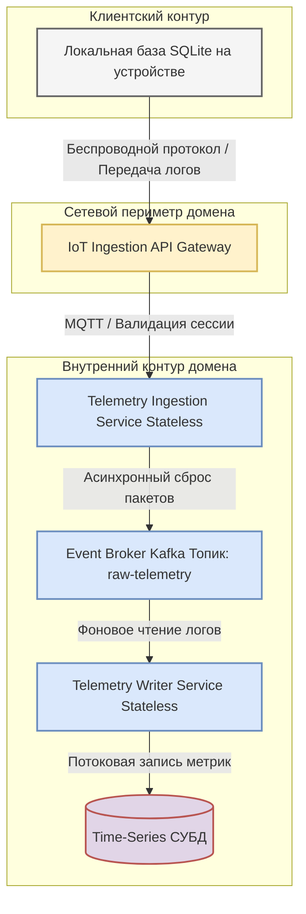

[← Назад в Главное меню](../README.md)

# Архитектурный концепт спортивной экосистемы
## Контур 13: Детальная компонентная архитектура доменов

Данный документ содержит подробные схемы внутренней начинки и компонентного состава каждого из четырех бизнес-доменов платформы. Описание фиксирует распределение обязанностей между микросервисами, связи с полиглотными базами данных и конкретные механизмы выполнения нефункциональных требований (НФТ).

---

### 1. Внутренняя структура Домена телеметрии и интеграции с устройствами

Домен работает под управлением изолированного шлюза IoT Ingestion и отвечает за стабильный прием, обработку и сохранение потока физических метрик и координат.

#### 1.1. Архитектурная схема компонентов домена

Данная схема показывает путь движения потоковых данных от фитнес-устройств через сетевую защиту, буферную очередь брокера и сервисы записи в специализированное хранилище.

#### 1.2. Спецификация компонентов контура

*   **Локальная база данных SQLite (на стороне пользователя).** Отвечает за выполнение сценария Offline-First. В условиях отсутствия сети накапливает секундные пакеты координат и пульса во внутренней памяти мобильного устройства, предотвращая потерю данных.
*   **IoT Ingestion API Gateway.** Сетевой шлюз на базе обратного прокси-сервера Envoy, изолированный от розничного B2C-трафика. Компонент терминирует SSL/TLS соединения, проверяет авторизационные токены участников и распределяет входящие MQTT-пакеты.
*   **Telemetry Ingestion Service.** Легковесный микросервис, написанный на высокопроизводительном языке (например, Go). Работает в режиме Stateless (без сохранения состояния). Его задача заключается в быстром приеме сообщения от шлюза, проверке структуры данных и сбросе пакета в асинхронную шину очередей.
*   **Event Broker Kafka (Топик `raw-telemetry`).** Асинхронная шина сообщений. Выступает в роли амортизатора и буфера памяти. Компонент защищает дисковую подсистему базы данных от каскадного падения во время массовых стартов или онлайн-марафонов.
*   **Telemetry Writer Service.** Сервис-подписчик (Worker), который в фоновом режиме вычитывает пакеты из Kafka, выполняет их математическую очистку от шумов и формирует финальные агрегированные логи. После успешной фиксации он отправляет в общую шину событие `TrainingCompleted` для уведомления других доменов экосистемы.
*   **Time-Series СУБД.** Специализированное колоночное хранилище, оптимизированное под моментальную потоковую запись миллионов строк и их автоматическое сжатие на дисках.

#### 1.3. Адресация атрибутов качества и НФТ

*   **Доступность и Надежность (Адресация НФТ 2.1, 2.2).** Изоляция записи в локальную SQLite при падении сети гарантирует автономность работы приложения. Использование протокола MQTT вместо тяжелого HTTP REST минимизирует объем служебных заголовков и экономит заряд фитнес-устройств.
*   **Скорость и Производительность (Адресация НФТ 2.3, 2.5).** Связка из Stateless-сервиса приема, буфера Kafka и Time-Series СУБД позволяет шлюзу мгновенно отвечать мобильному приложению за фиксированные миллисекунды. Даже если 150 000 устройств одновременно начнут выгрузку логов после соревнований, Kafka удержит пиковый шторм (до 30 000 сообщений в секунду) в оперативной памяти, а сервисы записи внесут данные на диски без потерь.
