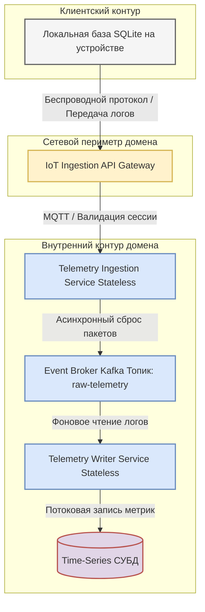
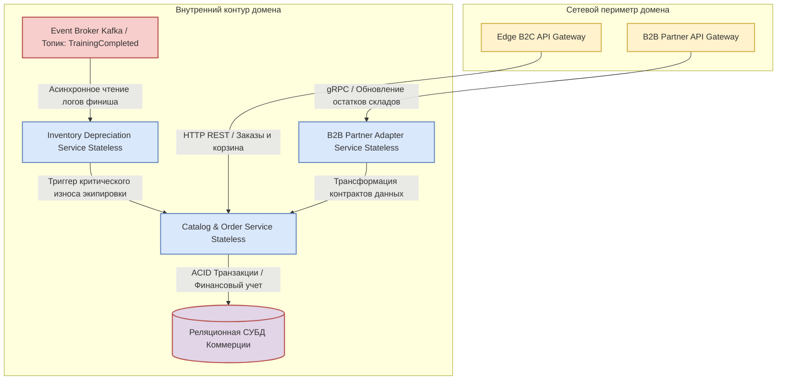
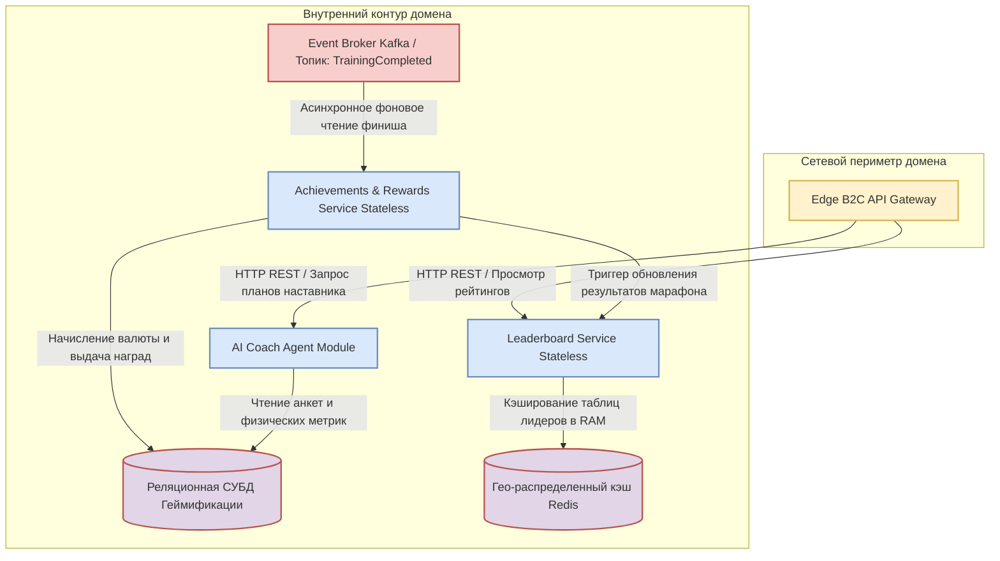
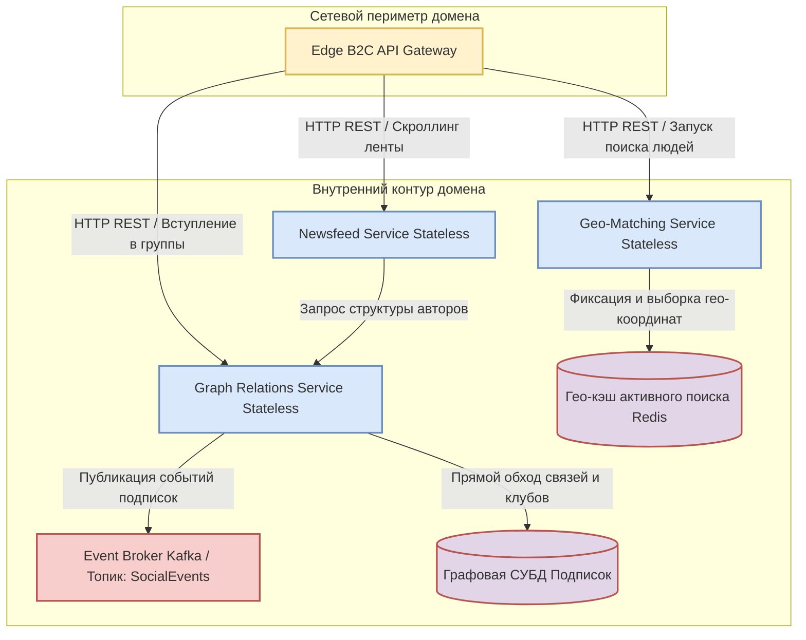
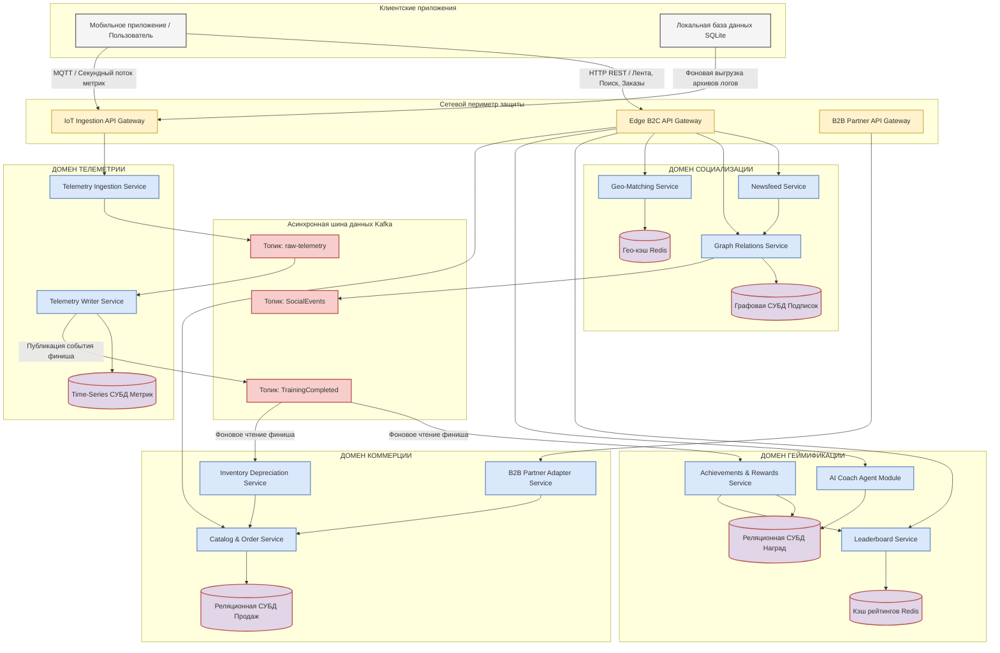

[← Назад в Главное меню](../README.md)

## Контур 13. Детальная компонентная архитектура доменов.

---

### 1. Внутренняя структура Домена телеметрии и интеграции с устройствами

Домен работает под управлением изолированного шлюза IoT Ingestion и отвечает за стабильный прием, обработку и сохранение потока физических метрик и координат.

#### 1.1. Архитектурная схема компонентов домена

Данная схема показывает путь движения потоковых данных от фитнес-устройств через сетевую защиту, буферную очередь брокера и сервисы записи в специализированное хранилище.

#### 1.2. Спецификация компонентов контура

*   **Локальная база данных SQLite (на стороне пользователя).** Отвечает за выполнение сценария Offline-First. В условиях отсутствия сети накапливает секундные пакеты координат и пульса во внутренней памяти мобильного устройства, предотвращая потерю данных.
*   **IoT Ingestion API Gateway.** Сетевой шлюз на базе обратного прокси-сервера Envoy, изолированный от розничного B2C-трафика. Компонент терминирует SSL/TLS соединения, проверяет авторизационные токены участников и распределяет входящие MQTT-пакеты.
*   **Telemetry Ingestion Service.** Легковесный микросервис, написанный на высокопроизводительном языке (например, Go). Работает в режиме Stateless (без сохранения состояния). Его задача заключается в быстром приеме сообщения от шлюза, проверке структуры данных и сбросе пакета в асинхронную шину очередей.
*   **Event Broker Kafka (Топик `raw-telemetry`).** Асинхронная шина сообщений. Выступает в роли амортизатора и буфера памяти. Компонент защищает дисковую подсистему базы данных от каскадного падения во время массовых стартов или онлайн-марафонов.
*   **Telemetry Writer Service.** Сервис-подписчик (Worker), который в фоновом режиме вычитывает пакеты из Kafka, выполняет их математическую очистку от шумов и формирует финальные агрегированные логи. После успешной фиксации он отправляет в общую шину событие `TrainingCompleted` для уведомления других доменов экосистемы.
*   **Time-Series СУБД.** Специализированное колоночное хранилище, оптимизированное под моментальную потоковую запись миллионов строк и их автоматическое сжатие на дисках.
*   
#### 1.3. Адресация атрибутов качества и НФТ в домене телеметрии

Каждое техническое решение в архитектуре данного контура напрямую обеспечивает выполнение зафиксированных нефункциональных требований.

* **Доступность (Выполнение НФТ 2.1 и 2.2).** Использование легкого протокола MQTT на сетевом периметре позволяет шлюзу стабильно упускать накладные расходы на сетевые заголовки и надежно удерживать миллионы одновременных сессий от фитнес-устройств. Автономный режим работы приложения с переключением записи на локальную базу данных SQLite гарантирует выживание системы при полном исчезновении интернета. Данные пользователей накапливаются локально и не теряются.
* **Скорость (Выполнение НФТ 2.3 и 2.5).** Разделение процесса на Stateless-сервис приема и фоновый сервис записи через брокер сообщений Kafka полностью снимает нагрузку с дисковой подсистемы. Сервис приема трафика освобождается за фиксированные миллисекунды, мгновенно отдавая ответ мобильному приложению. При выходе на связь 150 000 устройств во время массовых финишей, оперативная память Kafka выступает в роли демпфера, сглаживая пиковый шторм до 30 000 сообщений в секунду, а специализированная Time-Series СУБД обеспечивает моментальную потоковую фиксацию метрик на дисках без блокировки таблиц.
* **Тестируемость (Выполнение НФТ 2.4).** Архитектурное выделение шлюза IoT Ingestion и использование стандартизированных топиков в Kafka позволяет инженерам легко подключать виртуальные симуляторы датчиков к брокеру. Это обеспечивает безопасную проверку новых прошивок фитнес-устройств и измененных протоколов обмена данными на тестовых стендах, исключая риски для реального пользовательского трафика.

### 2. Внутренняя структура Домена продажи спортивных товаров (Commerce Domain)

Контур отвечает за бесшовную работу маркетплейса, ведение цифровых профилей экипировки, расчет амортизации инвентаря и автоматический таргетинг региональных коммерческих акций.

#### 2.1. Архитектурная схема компонентов домена

Схема демонстрирует разделение входящего трафика между розничными пользователями и партнерами, а также асинхронную обработку событий износа инвентаря.

#### 2.2. Спецификация компонентов контура

Каждый компонент внутри домена выполняет строго изолированную роль, взаимодействуя с базами данных и внешними системами по утвержденным протоколам.

*   **Edge B2C API Gateway.** Сетевой шлюз для розничных клиентов. Он обрабатывает входящие HTTP-запросы от мобильных приложений, отвечает за проверку сессий пользователей, кэширует статичные элементы каталогов и защищает внутренний контур от перегрузок.
*   **B2B Partner API Gateway.** Изолированный сетевой шлюз на базе gRPC. Он предназначен исключительно для приема тяжелых пакетов данных с остатками товаров и складскими обновлениями от внешних ИТ-систем дистрибьюторов.
*   **Catalog & Order Service.** Центральный микросервис маркетплейса, работающий в режиме Stateless. Он управляет корзиной покупок, проверяет актуальность цен, формирует заказы и нативно подмешивает рекламные баннеры в социальный контур на основе акций.
*   **Inventory Depreciation Service.** Сервис-подписчик, который слушает топик шины событий. Он извлекает данные о завершенных активностях пользователей, пересчитывает износ соответствующего инвентаря и при пересечении критических отметок передает сигнал в маркетинговый модуль для формирования скидки.
*   **B2B Partner Adapter Service.** Слой адаптеров, который преобразует кастомные форматы данных внешних складов партнеров к единому внутреннему стандарту платформы. Это защищает ядро корзины и каталога от изменений на стороне поставщиков.
*   **Реляционная СУБД Коммерции.** Выделенная база данных, обеспечивающая строгую транзакционность при оформлении заказов, списании баллов и фиксации покупок.

#### 2.3. Адресация атрибутов качества и НФТ в домене коммерции

Техническая структура маркетплейса спроектирована под выполнение жестких транзакционных требований бизнеса и защиту ядра системы от внешних изменений.

* **Доступность (Выполнение НФТ 4.3).** Архитектурная изоляция домена коммерции на уровне отдельной реляционной СУБД защищает финансовый контур от влияния Highload-нагрузок со стороны социальной сети. Выделение изолированного шлюза B2B Partner гарантирует стабильный прием складских обновлений и непрерывность продаж в розничном контуре, обеспечивая целевую доступность маркетплейса на уровне не менее 99.9% времени в год.
* **Скорость (Выполнение НФТ 4.1).** Перевод сервисов каталога и заказов в режим Stateless в сочетании с кэшированием карточек инвентаря на шлюзе Edge B2C позволяет отдавать пользователям актуальные витрины товаров со всеми ценами менее чем за 600 миллисекунд при средней загрузке сети.
* **Изменяемость (Выполнение НФТ 4.2 и 4.5).** Внедрение выделенного слоя B2B Partner Adapter Service позволяет инженерам за три рабочих дня подключать новых дистрибьюторов или менять правила синхронизации остатков без переписывания кода корзины покупок. Наличие адаптеров гарантирует бесперебойную работу старых версий мобильных приложений с корзиной в течение 6 месяцев при любых обновлениях внешних систем бренда.
* **Безопасность (Выполнение НФТ 4.4).** Все платежные операции, данные дисконтных карт и транзакции списания игровых баллов проходят сквозное шифрование на уровне приложения. Финансовые данные пользователей физически изолированы от социального контура на уровне СУБД, что исключает утечки конфиденциальной информации при компрометации других модулей.

 ### 3. Внутренняя структура Домена геймификации (Gamification Domain)

Контур обеспечивает расчет игровых достижений, начисление внутренней валюты, мгновенную работу таблиц лидеров соревнований и функционирование индивидуального ИИ-агента.

#### 3.1. Архитектурная схема компонентов домена

Схема демонстрирует асинхронный прием событий финиша тренировок, кэширование соревновательных рейтингов в оперативной памяти и контекстное подключение ИИ-модуля.

#### 3.2. Спецификация компонентов контура

Каждый компонент внутри домена выполняет изолированную роль, взаимодействуя с базами данных и шиной сообщений по утвержденным протоколам.

*   **Leaderboard Service.** Микросервис, работающий в режиме Stateless. Он отвечает за мгновенное формирование турнирных таблиц, расчет позиций участников в рамках челленджей и обновление списков лидеров соревнований.
*   **Achievements & Rewards Service.** Асинхронный сервис-подписчик. Он вычитывает события из шины данных, проверяет условия выполнения спортивных нормативов, начисляет внутреннюю игровую валюту на счета пользователей и фиксирует выдачу цифровых трофеев.
*   **AI Coach Agent Module.** Специализированный модуль интеллекта платформы. Он обрабатывает запросы пользователей на генерацию индивидуальных программ, считывает накопленную историю активностей и прогнозирует оптимальные параметры нагрузок.
*   **Реляционная СУБД Геймификации.** Выделенная база данных, обеспечивающая строгий учет баланса игровой валюты участников, хранение структуры испытаний, анкет здоровья и выданных медалей.
*   **Гео-распределенный кэш Redis.** Сверхбыстрое хранилище в оперативной памяти. Используется для моментального чтения актуальных таблиц лидеров, исключая прямые запросы к реляционной базе данных во время массовых онлайн-марафонов.

#### 3.3. Адресация атрибутов качества и НФТ в домене геймификации

Архитектура игрового контура спроектирована под мгновенный отклик соревновательных механик и безопасную изоляцию персональных медицинских данных.

* **Скорость (Выполнение НФТ 3.1, 3.2 и 3.3).** Благодаря асинхронной обработке финишей через шину событий, начисление игровой валюты происходит в течение 2 секунд с момента получения трека сервером. Кэширование соревновательных рейтингов в оперативной памяти Redis позволяет отдавать таблицы лидеров во время массовых марафонов с задержкой не более 10 секунд. Использование оптимизированных математических модулей расширения позволяет ИИ-агенту выдавать готовые рекомендации по нагрузкам и планам в течение 15 секунд.
* **Изменяемость (Выполнение НФТ 3.4).** Перевод сервисов в режим Stateless в сочетании с плагинной архитектурой позволяет разработчикам внедрять новые типы соревнований, челленджей и трофеев в виде изолированных модулей. Это исключает необходимость полной пересборки и остановки ядра геймификации.
* **Тестируемость (Выполнение НФТ 3.4).** Четкое разделение домена на независимые Stateless-сервисы и плагины позволяет инженерам изолированно тестировать новые игровые механики и алгоритмы начисления наград на синтетических данных, не затрагивая балансы реальных участников сообщества.
* **Безопасность (Выполнение НФТ 3.5).** Все персональные рекомендации ИИ, анкеты КБЖУ и физические показатели здоровья изолированы на уровне прав доступа приложений. Они физически недоступны для социального контура, защищены внутренними механизмами СУБД и открыты для чтения исключительно самому владельцу учетной записи.

### 4. Внутренняя структура Домена социальной сети (Social Domain)

Контур отвечает за виральный рост пользовательской базы, поиск напарников в реальном времени, управление спортивными сообществами и быструю генерацию новостной ленты.

#### 4.1. Архитектурная схема компонентов домена

Схема демонстрирует параллельное использование графовой СУБД для обхода связей и быстрой памяти Redis для мгновенного сопоставления гео-координат.

#### 4.2. Спецификация компонентов контура

Каждый компонент внутри домена выполняет изолированную роль, взаимодействуя с базами данных и шиной сообщений по утвержденным протоколам.

*   **Newsfeed Service.** Микросервис, работающий в режиме Stateless. Он отвечает за мгновенную генерацию новостной ленты для участников сообщества, собирает публикации из групп и подмешивает туда промоакции от маркетплейса.
*   **Graph Relations Service.** Сервис управления социальными связями. Он фиксирует подписки пользователей друг на друга, координирует создание спортивных клубов и управляет правами доступа участников внутри сообществ.
*   **Geo-Matching Service.** Высоконагруженный микросервис, отвечающий за сценарий мгновенного обнаружения людей поблизости. Он фиксирует текущие координаты участников и производит выборку по гео-радиальной сетке.
*   **Графовая СУБД Подписок.** Выделенная база данных, предназначенная для мгновенного обхода цепочек связей (друзья друзей, участники групп) без ресурсоемких операций сканирования таблиц.
*   **Гео-кэш активного поиска Redis.** Хранилище в оперативной памяти, использующее специализированные пространственные индексы для моментального сопоставления координат движущихся пользователей.

#### 4.3. Адресация атрибутов качества и НФТ в домене социальной сети

Архитектурные решения социального контура спроектированы под высокие нагрузки при чтении ленты и обеспечивают полную конфиденциальность домашних адресов участников.

* **Скорость (Выполнение НФТ 1.1 и 1.2).** Использование встроенных гео-индексов в оперативной памяти Redis позволяет осуществлять выборку и ротацию списка людей в радиусе одного километра менее чем за 1 секунду. Применение Графовой СУБД для обхода связей обеспечивает генерацию новостной ленты и рассылку уведомлений по цепочкам подписчиков в пределах 5 минут даже при финише массовых соревнований.
* **Изменяемость (Выполнение НФТ 1.3).** Архитектурные особенности Графовой СУБД позволяют гибко менять или расширять структуру социальных групп (добавлять новые кастомные поля описания или типы интересов) силами одного инженера за один рабочий день. Изменения вносятся напрямую в схему узлов без остановки сервиса и проведения тяжелых миграций данных.
* **Тестируемость (Выполнение НФТ 1.4).** Наличие изолированного API на стороне сервиса новостной ленты позволяет развернуть независимую среду автоматической проверки совместимости контрактов. Это гарантирует, что изменения структуры новых постов не нарушат корректное отображение старых публикаций в мобильных приложениях.
* **Безопасность (Выполнение НФТ 1.5).** Сервис управления связями снабжен алгоритмом автоматического маскирования координат. При публикации тренировок в общую ленту система принудительно размывает точки старта и финиша в радиусе 200 метров от домашнего адреса пользователя, защищая участников от скрытого отслеживания.

### 5. Итоговая схема проекта.

