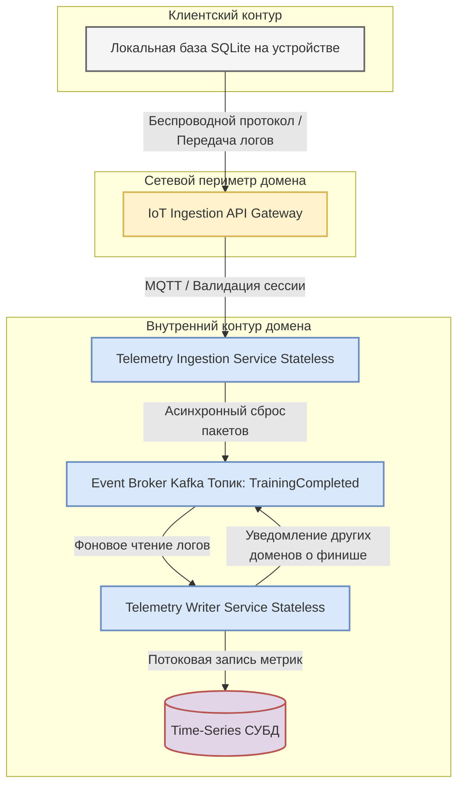
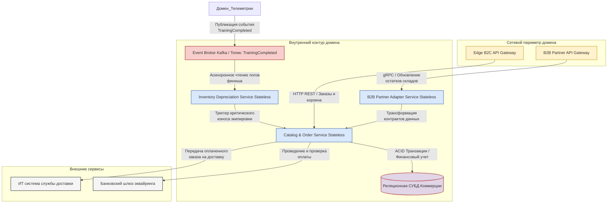
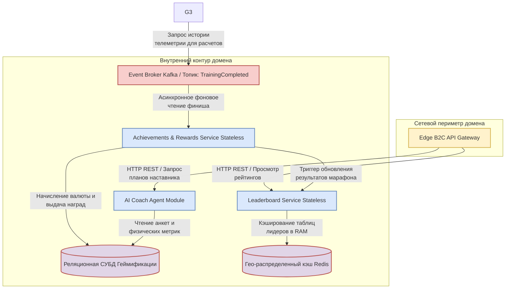
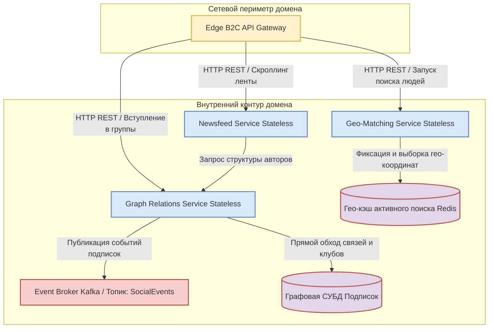
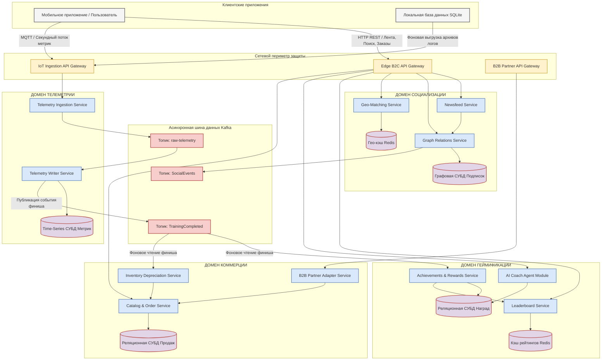

[← Назад в Главное меню](../README.md)

## Контур 13. Детальная архитектура доменов.

---

### 1. Внутренняя структура домена телеметрии и интеграции с устройствами.

Домен работает под управлением изолированного шлюза IoT Ingestion и отвечает за стабильный прием, обработку и сохранение потока физических метрик и геоданных.

#### 1.1. Архитектурная схема домена.

Данная схема показывает путь движения потоковых данных через сетевую защиту, буферную очередь брокера и сервисы записи в специализированное хранилище.

#### 1.2. Спецификация компонентов контура.

*   **Локальная база данных SQLite (на стороне пользователя).** Отвечает за выполнение сценария Offline-First. В условиях отсутствия сети накапливает телеметрию, предотвращая потерю данных.
*   **IoT Ingestion API Gateway.** Сетевой шлюз, изолированный от розничного B2C-трафика. Компонент расшифровывает и распределяет входящие MQTT-пакеты.
*   **Telemetry Ingestion Service.** Легковесный микросервис, написанный на высокопроизводительном языке. Работает в режиме Stateless (без сохранения состояния). Его задача заключается в быстром приеме сообщения от шлюза, проверке структуры данных и сбросе пакета в асинхронную шину очередей.
*   **Event Broker Kafka.** Асинхронная шина сообщений.
*   **Telemetry Writer Service.** Сервис-подписчик, который в фоновом режиме вычитывает пакеты из Kafka, выполняет очистку от шумов и формирует финальные агрегированные логи. После формирования очищенного пакета логов он направляет их в базу данных, а в шину сообщений отправляет событие, которое уведомляет домены об обновлении телеметрии.
*   **Time-Series СУБД.** Специализированное колоночное хранилище, оптимизированное под моментальную потоковую запись миллионов строк и их автоматическое сжатие на дисках.
  
#### 1.3. Адресация атрибутов качества и НФТ в домене телеметрии.

Каждое техническое решение в архитектуре данного контура напрямую обеспечивает выполнение зафиксированных НФТ и связанных с ними атрибутов качества (указывали ранее в 9 артефакте). Далее схожие блоки для каждого домена будут также обосновывать выполнение каждого НФТ и связанных с ним атрибутов качества.

* **Выполнение НФТ 2.1 и 2.2.** Использование легкого протокола MQTT позволяет надежно удерживать миллионы одновременных сессий от фитнес-устройств. Автономный режим работы приложения с переключением записи на локальную базу данных SQLite гарантирует работу системы при полном исчезновении интернета.
* **Выполнение НФТ 2.3 и 2.5.** Разделение процесса на Stateless-сервис приема и сервис записи через брокер сообщений Kafka делает систему устойчивой. Оперативная память Kafka сглаживает скачки потоков сообщений, Time-Series СУБД обеспечивает моментальную фиксацию метрик на дисках без блокировки таблиц.
* **Выполнение НФТ 2.4.** Архитектурное выделение шлюза IoT Ingestion и использование Kafka позволяет инженерам легко подключать виртуальные симуляторы датчиков к брокеру для удобного тестирования системы.

### 2. Внутренняя структура домена продажи спортивных товаров.

Контур отвечает работу маркетплейса, ведение цифровых профилей экипировки, расчет износа инвентаря и автоматическое формирование акций.

#### 2.1. Архитектурная схема домена.

Схема демонстрирует разделение входящего трафика между розничными пользователями и партнерами, а также асинхронную обработку событий износа инвентаря.

#### 2.2. Спецификация компонентов контура.

*   **Edge B2C API Gateway.** Сетевой шлюз для розничных клиентов. Он обрабатывает входящие HTTP-запросы от мобильных приложений, отвечает за проверку сессий пользователей, кэширует статичные элементы каталогов и защищает внутренний контур от перегрузок.
*   **B2B Partner API Gateway.** Изолированный сетевой шлюз. Он предназначен исключительно для приема тяжелых пакетов данных с остатками товаров и складскими обновлениями от внешних ИТ-систем дистрибьюторов.
*   **Catalog & Order Service.** Центральный микросервис маркетплейса, работающий в режиме Stateless. Он управляет корзиной покупок, проверяет актуальность цен, формирует заказы и подмешивает рекламные баннеры в социальный домен.
*   **Inventory Depreciation Service.** Сервис-подписчик на шину событий. Он извлекает данные о завершенных активностях пользователей, пересчитывает износ инвентаря и передает сигнал в маркетинговый модуль для формирования индивидуального предложения.
*   **B2B Partner Adapter Service.** Слой адаптеров, который преобразует кастомные форматы данных внешних складов партнеров к единому внутреннему стандарту платформы. Это защищает ядро корзины и каталога от изменений на стороне поставщиков.
*   **Реляционная СУБД Коммерции.** Выделенная база данных, хранящая информацию о заказах, списании баллов, фиксации покупок, карточки товаров и историю финансовых транзакций.

#### 2.3. Адресация атрибутов качества и НФТ в домене коммерции.

* **Выполнение НФТ 4.3.** Архитектурная изоляция домена коммерции на уровне отдельной реляционной СУБД защищает финансовый контур от влияния со стороны социальной сети. Выделение изолированного шлюза B2B Partner гарантирует стабильный прием складских обновлений и непрерывность продаж в розничном контуре.
* **Выполнение НФТ 4.1.** Перевод сервисов каталога и заказов в режим Stateless в сочетании с кэшированием карточек инвентаря на шлюзе Edge B2C позволяет отдавать пользователям актуальные витрины товаров со всеми ценами менее чем за 600 миллисекунд при средней загрузке сети.
* **Выполнение НФТ 4.2 и 4.5.** Внедрение выделенного слоя B2B Partner Adapter Service позволяет инженерам за несколько рабочих дней подключать новых дистрибьюторов или менять правила синхронизации остатков без переписывания кода. Наличие адаптеров гарантирует бесперебойную работу старых версий мобильных приложений с корзиной.
* **Выполнение НФТ 4.4.** Все платежные операции, данные дисконтных карт и транзакции списания игровых баллов проходят сквозное шифрование на уровне приложения и изолированы от других доменов на уровне СУБД.

 ### 3. Внутренняя структура Домена геймификации.

#### 3.1. Архитектурная схема компонентов домена.

Схема демонстрирует асинхронный прием событий окончания тренировок, кэширование соревновательных рейтингов в оперативной памяти и контекстное подключение ИИ-модуля.

#### 3.2. Спецификация компонентов контура.

*   **Leaderboard Service.** Микросервис, работающий в режиме Stateless. Он отвечает за мгновенное формирование турнирных таблиц, расчет позиций участников в рамках челленджей и обновление списков лидеров соревнований.
*   **Achievements & Rewards Service.** Асинхронный сервис-подписчик. Он вычитывает события из шины данных, проверяет условия выполнения спортивных нормативов, начисляет внутреннюю игровую валюту на счета пользователей и фиксирует выдачу цифровых трофеев.
*   **AI Coach Agent Module.** Дообученный нами под нужды нашего приложения внешний ИИ-агент. Он обрабатывает запросы пользователей на генерацию индивидуальных программ, считывает накопленную историю активностей и прогнозирует оптимальные параметры нагрузок.
*   **Реляционная СУБД Геймификации.** Выделенная база данных, обеспечивающая строгий учет баланса игровой валюты участников, хранение структуры испытаний, анкет здоровья и выданных медалей.
*   **Гео-распределенный кэш Redis.** Сверхбыстрое хранилище в оперативной памяти. Используется для моментального чтения актуальных таблиц лидеров, исключая прямые запросы к реляционной базе данных во время онлайн-соревнований.

#### 3.3. Адресация атрибутов качества и НФТ в домене геймификации.

* **Выполнение НФТ 3.1, 3.2.** Благодаря асинхронной обработке финишей через шину событий, начисление игровой валюты происходит в течение нескольких секунд с момента получения трека сервером. Кэширование соревновательных рейтингов в оперативной памяти Redis позволяет отдавать таблицы лидеров во время массовых марафонов с задержкой не более 10 секунд.
* **Выполнение НФТ 3.3.** Из-за того, что мы берём готовую языковую модель и дообучаем её под наши нужды, мы можем создавать несколько версий ИИ-агента для соблюдения региональных законов и моральных устоев.
* **Выполнение НФТ 3.4.** Четкое разделение домена на независимые Stateless-сервисы и плагины позволяет инженерам изолированно тестировать новые игровые механики и алгоритмы начисления наград на синтетических данных, не затрагивая балансы реальных участников сообщества.
* **Выполнение НФТ 3.5.** Все персональные рекомендации ИИ, анкеты КБЖУ и физические показатели здоровья изолированы на уровне прав доступа приложений. Они физически недоступны для социального домена, защищены внутренними механизмами СУБД и открыты для чтения исключительно самому владельцу учетной записи.

### 4. Внутренняя структура Домена социальной сети.

Контур отвечает за виральный рост пользовательской базы, поиск напарников в реальном времени, управление спортивными сообществами и быструю генерацию новостной ленты.

#### 4.1. Архитектурная схема компонентов домена.

Схема демонстрирует параллельное использование графовой СУБД для обхода связей и быстрой памяти Redis для мгновенного сопоставления гео-координат.

#### 4.2. Спецификация компонентов контура.

Каждый компонент внутри домена выполняет изолированную роль, взаимодействуя с базами данных и шиной сообщений по утвержденным протоколам.

*   **Newsfeed Service.** Микросервис, работающий в режиме Stateless. Он отвечает за мгновенную генерацию новостной ленты для участников сообщества, собирает публикации из групп и подмешивает туда промоакции от маркетплейса.
*   **Graph Relations Service.** Сервис управления социальными связями. Он фиксирует подписки пользователей друг на друга, координирует создание спортивных клубов и управляет правами доступа участников внутри сообществ.
*   **Geo-Matching Service.** Высоконагруженный микросервис, отвечающий за сценарий мгновенного обнаружения людей поблизости. Он фиксирует текущие координаты участников и производит выборку по гео-радиальной сетке.
*   **Графовая СУБД Подписок.** Выделенная база данных, предназначенная для мгновенного обхода цепочек связей (друзья друзей, участники групп) без ресурсоемких операций сканирования таблиц.
*   **Гео-кэш активного поиска Redis.** Хранилище в оперативной памяти, использующее специализированные пространственные индексы для моментального сопоставления координат движущихся пользователей.

#### 4.3. Адресация атрибутов качества и НФТ в домене социальной сети.

* **Скорость (Выполнение НФТ 1.1 и 1.2).** Использование встроенных гео-индексов в оперативной памяти Redis позволяет осуществлять выборку и ротацию списка людей в радиусе одного километра менее чем за 1 секунду. Применение Графовой СУБД для обхода связей обеспечивает генерацию новостной ленты и рассылку уведомлений по цепочкам подписчиков в пределах 5 минут даже при финише массовых соревнований.
* **Изменяемость (Выполнение НФТ 1.3).** Архитектурные особенности Графовой СУБД позволяют гибко менять или расширять структуру социальных групп (добавлять новые кастомные поля описания или типы интересов) силами одного инженера за один рабочий день. Изменения вносятся напрямую в схему узлов без остановки сервиса и проведения тяжелых миграций данных.
* **Тестируемость (Выполнение НФТ 1.4).** Наличие изолированного API на стороне сервиса новостной ленты позволяет развернуть независимую среду автоматической проверки совместимости контрактов. Это гарантирует, что изменения структуры новых постов не нарушат корректное отображение старых публикаций в мобильных приложениях.
* **Безопасность (Выполнение НФТ 1.5).** Сервис управления связями снабжен алгоритмом автоматического маскирования координат. При публикации тренировок в общую ленту система принудительно размывает точки старта и финиша в радиусе 200 метров от домашнего адреса пользователя, защищая участников от скрытого отслеживания.

### 5. Итоговая схема проекта.

